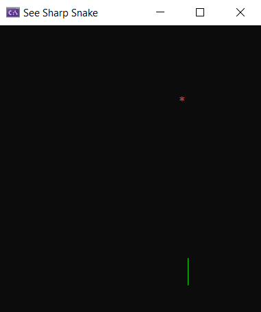

# A self-contained C# game in 8 kB

This repo is a complement to my [article on building an 8 kB self-contained game in C#](https://medium.com/@MStrehovsky/building-a-self-contained-game-in-c-under-8-kilobytes-74c3cf60ea04?sk=334b06f72dad47f15d0ba0cc6a502487). By self-contained I mean _this 8 kB C# game binary doesn't need a .NET runtime to work_. See the article on how that's done.

The project files and scripts in this repo build the same game (Snake clone) in several different configurations, each with a different size of the output.

😱 Scroll all the way down for instructions on how to run this on DOS.



## Building

### To build the 65 MB version of the game

```
dotnet publish -r win-x64 -c Release
```

### To build the 25 MB version of the game

```
dotnet publish -r win-x64 -c Release /p:PublishTrimmed=true
```

### ⚠️ WARNING: additional requirements needed for the below configuration

Make sure you have Visual Studio 2019 installed (Community edition is free) and include C/C++ development tools with Windows SDK (we need a tiny fraction of that - the platform linker and Win32 import libraries).

### To build the 4.7 MB version of the game

```
dotnet publish -r win-x64 -c Release /p:Mode=CoreRT
```

### To build the 4.3 MB version of the game

```
dotnet publish -r win-x64 -c Release /p:Mode=CoreRT-Moderate
```

### To build the 3.0 MB version of the game

```
dotnet publish -r win-x64 -c Release /p:Mode=CoreRT-High
```

### To build the 1.2 MB version of the game

```
dotnet publish -r win-x64 -c Release /p:Mode=CoreRT-ReflectionFree
```

### To build the 10 kB version of the game

```
dotnet publish -r win-x64 -c Release /p:Mode=CoreRT-NoRuntime
```

### To build the 8 kB version of the game

1. Open "x64 Native Tools Command Prompt for VS 2019" (it's in your Start menu)
2. CD into the repo root directory

```
csc.exe /debug /O /noconfig /nostdlib /runtimemetadataversion:v4.0.30319 MiniRuntime.cs MiniBCL.cs Game\FrameBuffer.cs Game\Random.cs Game\Game.cs Game\Snake.cs Pal\Thread.Windows.cs Pal\Environment.Windows.cs Pal\Console.Windows.cs Pal\Console.cs /out:zerosnake.ilexe /langversion:latest /unsafe
```

Find ilc.exe (the [CoreRT](http://github.com/dotnet/corert) ahead of time compiler) on your machine. If you completed any of the above steps that produce outputs <= 4.7 MB, ilc.exe will be in your NuGet package cache (somewhere like `%USERPROFILE%\.nuget\packages\runtime.win-x64.microsoft.dotnet.ilcompiler\1.0.0-alpha-27402–01\tools`).

```
[PATH_TO_ILC_EXE]\ilc.exe zerosnake.ilexe -o zerosnake.obj --systemmodule:zerosnake --Os -g
```

```
link.exe /debug:full /subsystem:console zerosnake.obj /entry:__managed__Main kernel32.lib ucrt.lib /merge:.modules=.rdata /merge:.pdata=.rdata /incremental:no /DYNAMICBASE:NO /filealign:16 /align:16
```

## Contributing
Contributions are welcome, but I would like to keep the game simple and small. If you would like to add features like levels or achievements, you might want to just fork this repo.

In general, I welcome:

* Making the 8 kB version of the game run on Linux and macOS (the bigger versions of the game should work just fine on Unixes, but the tiny version that p/invokes into the platform APIs is OS specific)
* Adding a configuration that builds the game as an [EFI boot application](https://github.com/MichalStrehovsky/zerosharp/tree/master/efi-no-runtime) so that it can run without an OS
* Bug fixes
* Making the CSPROJ also handle the 8 kB case so that we don't need to mess with the command prompt
* Small experience improvements (e.g. handling ESC key to exit the game)

## To build for DOS

Very similar instructions to the 8 kB version:

```
csc.exe /debug /O /noconfig /nostdlib /runtimemetadataversion:v4.0.30319 MiniRuntime.cs MiniRuntime.Dos.cs  MiniBCL.cs Game\FrameBuffer.cs Game\Random.cs Game\Game.cs Game\Snake.cs Pal\Thread.Dos.cs Pal\Environment.Dos.cs Pal\Console.Dos.cs Pal\Console.cs /out:zerosnake.ilexe /langversion:latest /unsafe
```

```
[PATH_TO_ILC_EXE]\ilc.exe zerosnake.ilexe --systemmodule:zerosnake -o zerosnake.obj
```

```
link /subsystem:native /entry:__managed__Main zerosnake.obj /stub:dos64stb.bin
```

The DOS64STB blob is https://github.com/Baron-von-Riedesel/Dos64-stub.

## Run on UEFI

### To build the 11 kB Uefi version of the game

```
dotnet publish -r win-x64 -c Release /p:Mode=CoreRT-Uefi
```

This produce UEFI executable stored on the VHDX file in the `bin\x64\Release\netcoreapp3.1\win-x64\native\seesharpsnake.vhdx`
location, now it's time to create VM out of that VHDX file and launch it.

Open Powershell or Powershell Core session and run commands below.

```powershell
New-VM -Name SeeSharpSnake -MemoryStartupBytes 32MB -Generation 2 -VHDPath "bin\x64\Release\netcoreapp3.1\win-x64\native\seesharpsnake.vhdx"
Set-VMFirmware -VMName SeeSharpSnake -EnableSecureBoot Off
Set-VM -Name SeeSharpSnake -AutomaticCheckpointsEnabled $false -CheckpointType Disabled
```

and now connect to your VM using

```
vmconnect localhost SeeSharpSnake
```

Press Ctrl+S and enjoy!
